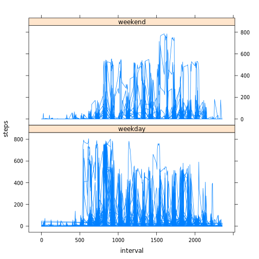
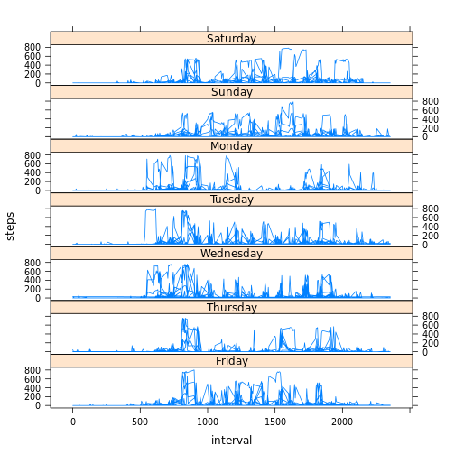
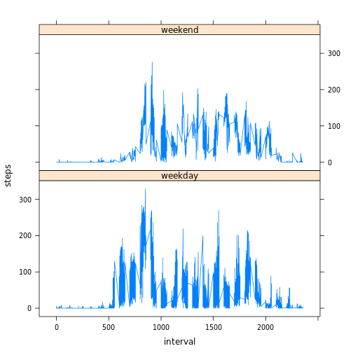
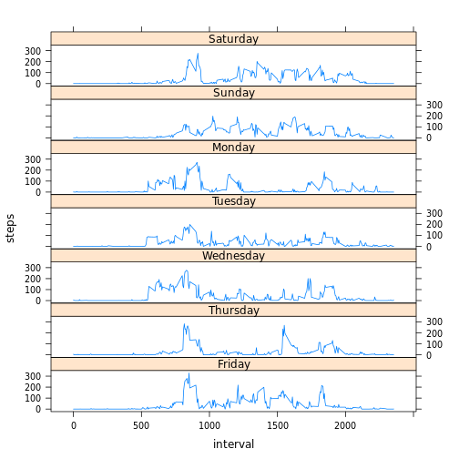

# Reproducible Research: Peer Assessment 1


## Loading and preprocessing the data
### Show any code that is needed to load the data (i.e. read.csv())
First, we prepare the load the data.  I parameterize the directory and create the directory if needed.


```r
dataDir <- "./data"
if(!file.exists(dataDir)) {dir.create(dataDir)}
```

Next, I parameterize the URL and filename, and download the file.

```r
fileUrl <- "https://d396qusza40orc.cloudfront.net/repdata%2Fdata%2Factivity.zip"
destFileName <- "activity.zip"
fullDataPathFile <- paste(dataDir,"/",destFileName,sep="")
download.file(fileUrl,destfile=fullDataPathFile,method="curl")
```

Last, I unzip the file to the data directory and load it into the activity data frame.

```r
unzip("./data/activity.zip",exdir=dataDir)
activity_raw <- read.csv("./data/activity.csv", na.strings="NA")
```

We are going to create some additional factors on the raw data regarding what day and day type it is for later use.  

```r
activity_raw$day = weekdays(as.Date(activity_raw$date))
activity_raw$day <- factor(activity_raw$day)
activity_raw$dayType = ifelse(activity_raw$day %in% c("Sunday","Saturday"),"weekend","weekday")
activity_raw$dayType <- factor(activity_raw$dayType)
```


### Process/transform the data (if necessary) into a format suitable for your analysis
To make things a little easier, we are going to leverage the melt function from the reshape2 library, so we have to install and load that now.


```r
if(!require("reshape2"))
{
  install.packages("reshape2",repos="http://cran.rstudio.com/")
  library(reshape2)
}
```

```
## Loading required package: reshape2
```

First let's create a data frame with NA's removed.

```r
activity <- activity_raw[!is.na(activity_raw$steps),]
```

Next we "melt" the activity table to allow us to create some derived data sets that we can more easily manipulate for graphing and exploration.


```r
activityMelt <- melt(activity,id=c("date","interval"),measure.vars=c("steps"))
dateTotalActivity <- dcast(activityMelt, date ~ variable, sum)
intervalAverageActivity <- dcast(activityMelt, interval ~ variable, mean)
```
<!--
  this could have just as easily been accomplished with tapply, e.g. 
    dateTotalActivity_tapply <- tapply(activity$steps,activity$date,sum)
    hist(dateTotalActivity_tapply,breaks=10,xlab="Total Steps Per Day",main="Histogram of Total Daily Steps")
    summary(dateTotalActivity_tapply)
  but I wanted to play with melt/dcast 
-->

At this point, we are ready to begin the analysis.

## What is mean total number of steps taken per day?
### For this part of the assignment, you can ignore the missing values in the dataset.
### Make a histogram of the total number of steps taken each day
We can easily generate a histogram of the data using the code below.  Note we generated additional breaks to get a better characterization of the distribution.  We also include a quick summary of the data.

```r
hist(dateTotalActivity$steps,breaks=20,xlab="Total Steps Per Day",main="Histogram of Total Daily Steps")
```

 

```r
summary(dateTotalActivity$steps)
```

```
##    Min. 1st Qu.  Median    Mean 3rd Qu.    Max. 
##      41    8840   10800   10800   13300   21200
```

### Calculate and report the mean and median total number of steps taken per day
Using the na.rm option, we get an adjusted mean and median here.

```r
mean(dateTotalActivity$steps,na.rm=TRUE)
```

```
## [1] 10766
```

```r
median(dateTotalActivity$steps,na.rm=TRUE)
```

```
## [1] 10765
```


## What is the average daily activity pattern?
### Make a time series plot (i.e. type = "l") of the 5-minute interval (x-axis) and the average number of steps taken, averaged across all days (y-axis)

```r
plot(intervalAverageActivity$interval,intervalAverageActivity$steps,type="l",xlab="Interval Number",ylab="Average Daily Steps")
```

 
### Which 5-minute interval, on average across all the days in the dataset, contains the maximum number of steps?

```r
intervalAverageActivity[intervalAverageActivity$steps == max(intervalAverageActivity$steps),]
```

```
##     interval steps
## 104      835 206.2
```

```r
intervalAverageActivity[intervalAverageActivity$steps == max(intervalAverageActivity$steps),]$interval
```

```
## [1] 835
```


## Imputing missing values

### Calculate and report the total number of missing values in the dataset (i.e. the total number of rows with NAs)

```r
missing <- activity_raw[is.na(activity_raw$steps),]
sum(is.na(activity_raw$steps))
```

```
## [1] 2304
```
I have also generated a missing vector for replacing values later on.

### Devise a strategy for filling in all of the missing values in the dataset. The strategy does not need to be sophisticated. For example, you could use the mean/median for that day, or the mean for that 5-minute interval, etc.

I'm going to test out BOTH of these strategies - using the mean for that date, and using the mean for that 5-minute interval.

### Create a new dataset that is equal to the original dataset but with the missing data filled in.

There will actually be 2 data sets, one using method 1 (daily average to fill NA) and one using method 2 (interval average to fill NA).  

First, we are going to load up the plyr library.

```r
if(!require("plyr"))
{
  install.packages("plyr",repos="http://cran.rstudio.com/")
  library(plyr)
}
```

```
## Loading required package: plyr
```

Now we add daily and interval averages to the data, and create 2 additional columns merging that data against the raw steps data.

```r
imputedActivity <- ddply(activity_raw,"date",mutate,dailyAverage=mean(steps, na.rm=TRUE))
imputedActivity <- ddply(imputedActivity,"interval",mutate,intervalAverage=mean(steps,na.rm=TRUE))
imputedActivity$intervalSteps <- ifelse(is.na(imputedActivity$steps),imputedActivity$intervalAverage,imputedActivity$steps)
imputedActivity$dailySteps <- ifelse(is.na(imputedActivity$steps),imputedActivity$dailyAverage,imputedActivity$steps)
```

### Make a histogram of the total number of steps taken each day and Calculate and report the mean and median total number of steps taken per day. Do these values differ from the estimates from the first part of the assignment? What is the impact of imputing missing data on the estimates of the total daily number of steps?


```r
activityIntervalMelt <- melt(imputedActivity,id=c("date","interval"),measure.vars=c("intervalSteps"))
dateTotalActivityInterval <- dcast(activityIntervalMelt, date ~ variable, sum)
activityDailyMelt <- melt(imputedActivity,id=c("date","interval"),measure.vars=c("dailySteps"))
dateTotalActivityDaily <- dcast(activityDailyMelt, date ~ variable, sum)
```

Using almost the same code from above, let's get these two histograms and compare them against the original.


```r
hist(dateTotalActivity$steps,breaks=20,xlab="Total Steps Per Day",main="Histogram of Total Daily Steps")
```

 

```r
hist(dateTotalActivityInterval$intervalSteps,breaks=20,xlab="Total Steps Per Day",main="Histogram of Total Daily Steps (Interval Impute)")
```

 

```r
hist(dateTotalActivityDaily$dailySteps,breaks=20,xlab="Total Steps Per Day",main="Histogram of Total Daily Steps (Daily Impute)")
```

 

```r
summary(dateTotalActivity$steps)
```

```
##    Min. 1st Qu.  Median    Mean 3rd Qu.    Max. 
##      41    8840   10800   10800   13300   21200
```

```r
summary(dateTotalActivityInterval$intervalSteps)
```

```
##    Min. 1st Qu.  Median    Mean 3rd Qu.    Max. 
##      41    9820   10800   10800   12800   21200
```

```r
summary(dateTotalActivityDaily$dailySteps)
```

```
##    Min. 1st Qu.  Median    Mean 3rd Qu.    Max.    NA's 
##      41    8840   10800   10800   13300   21200       8
```

### Calculate and report the mean and median total number of steps taken per day
Using the na.rm option, we get an adjusted mean and median here.

```r
mean(dateTotalActivity$steps,na.rm=TRUE)
```

```
## [1] 10766
```

```r
median(dateTotalActivity$steps,na.rm=TRUE)
```

```
## [1] 10765
```

```r
mean(dateTotalActivityInterval$intervalSteps,na.rm=TRUE)
```

```
## [1] 10766
```

```r
median(dateTotalActivityInterval$intervalSteps,na.rm=TRUE)
```

```
## [1] 10766
```

```r
mean(dateTotalActivityDaily$dailySteps,na.rm=TRUE)
```

```
## [1] 10766
```

```r
median(dateTotalActivityDaily$dailySteps,na.rm=TRUE)
```

```
## [1] 10765
```

So this is peculiar.  The histogram for the interval average method has gotten bigger, but none of the summary statistics have changed.  I suspect this is because most of the NAs were for entire days, and this is why we still have NAs in the summary data for the daily averaging approach (because there were no values that day to average).  Perhaps a better approach would be to use the mean for that interval during that weekday()?  That may exceed my limited R capabilities at this time.

Let's give it a shot anyways!  First, I split the data by day and generate some means, then I'm going to see if I can sub in the means where raw data is NA.


```r
by_day <- split(activity_raw,activity_raw$day)
by_day_interval_means <- unlist(lapply(by_day, function(x) tapply(x$steps,x$interval,mean,na.rm=T)))
activity_clean <- activity_raw
activity_clean$steps <- ifelse(is.na(activity_raw$steps),by_day_interval_means[paste0(activity_raw$day,".",activity_raw$interval)],activity_raw$steps)
```

And now let's look at the new data.

```r
daily_activity_clean <- ddply(activity_clean,c("date"),summarise,steps = sum(steps))
hist(daily_activity_clean$steps,breaks=20,xlab="Total Steps Per Day",main="Histogram of Total Daily Steps")
```

 

```r
summary(daily_activity_clean$steps)
```

```
##    Min. 1st Qu.  Median    Mean 3rd Qu.    Max. 
##      41    8920   11000   10800   12800   21200
```

```r
mean(daily_activity_clean$steps)
```

```
## [1] 10821
```

```r
median(daily_activity_clean$steps)
```

```
## [1] 11015
```

The graph isn't really different but it does look like we have some better / increased mean median data.

## Are there differences in activity patterns between weekdays and weekends?

### Create a new factor variable in the dataset with two levels – “weekday” and “weekend” indicating whether a given date is a weekday or weekend day.

I already did this above to allow for the improved impute.

### Make a panel plot containing a time series plot (i.e. type = "l") of the 5-minute interval (x-axis) and the average number of steps taken, averaged across all weekday days or weekend days (y-axis). 

We are going to use the Lattice library, so here we load that if needed.

```r
if(!require("lattice"))
{
  install.packages("lattice",repos="http://cran.rstudio.com/")
  library(lattice)
}
```

```
## Loading required package: lattice
```


```r
xyplot(steps~interval |dayType, activity_clean,type="l",layout=c(1,2))
```

 

It looks like there is a difference between weekdays and weekends.  To explore this further I also took a look at the day by day comparisons.


```r
xyplot(steps~interval |day, activity_clean,index.cond=list(c(1,5,7,6,2,4,3)),type="l",layout=c(1,7))
```

 

The first time I did this I received some feedback that I was using ALL the data and not the means.  Let's see if we can get just the means for a cleaner graph (although I sortof like the separate lines showing that there are some "breakout" days/times, but there is surely a better way to visualize that).


```r
interval_activity_clean <- ddply(activity_clean,c("interval","day","dayType"),summarise,steps=mean(steps))
xyplot(steps~interval |dayType, interval_activity_clean,type="l",layout=c(1,2))
```

 

```r
xyplot(steps~interval |day, interval_activity_clean,index.cond=list(c(1,5,7,6,2,4,3)),type="l",layout=c(1,7))
```

 

You will note that these numbers are a lot smaller, likely because the breakaway "800 steps" only occured during 1 of several intervals, so the AVERAGE # of steps in a given interval across all Saturdays is lower.
